# Plankton Classifier System Architecture

This document provides a system architecture diagram showing the complete data flow and system components for the plankton classifier system.

---

## System Architecture Diagram

```mermaid
flowchart TB
    subgraph System["plankton_classifier.today"]
        subgraph Input["Data Input & Processing"]
            IFCB1[IFCB Instruments<br/>HRI, POC, TSA, XYZ]
            SFTP[SFTP Transfer<br/>Port 22]
            Uploads[Uploads<br/>ROI Files]
            Archive[Archive<br/>ROI Storage]
            ROIToPNG[ROI to PNG<br/>Conversion]
        end
        
        subgraph Storage["Data Storage"]
            PlanktonDB[(Plankton DB<br/>SQLite)]
            ImageStorage[Image Storage<br/>File System<br/>project/year/month/class/]
        end
        
        subgraph Models["Model & Classification"]
            ModelFile[PyTorch Model<br/>plankton.pth<br/>ResNet-50]
            Classification[Classification<br/>Engine]
            ConfidenceCheck{Confidence<br/>>= 0.7?}
            Classified[Classified<br/>Images]
            Unclassified[Unclassified<br/>Images]
        end
        
        subgraph ML["AI/ML Processing"]
            ResNet[ResNet-50<br/>Neural Network]
            Prediction[Prediction<br/>Engine]
            ClassMapping[Class Mapping<br/>Model Classes]
        end
        
        subgraph Output["Output & Visualization"]
            DygraphData[Dygraph Data<br/>Time Series]
            CountData[Plankton Count<br/>Aggregation]
            WebInterface[Web Interface<br/>WWW]
        end
        
        subgraph Management["Project & Class Management"]
            ProjectMgmt[Project<br/>Management]
            ClassMgmt[Class<br/>Management]
            UserAuth[User<br/>Authentication<br/>Firebase]
        end
    end
    
    User[👤 User]
    
    %% Data Flow - Input
    IFCB1 -->|SFTP Push| SFTP
    SFTP --> Uploads
    Uploads --> Archive
    Uploads --> ROIToPNG
    
    %% Data Flow - Processing
    ROIToPNG --> Classification
    ModelFile --> Classification
    Classification --> ConfidenceCheck
    ConfidenceCheck -->|Yes| Classified
    ConfidenceCheck -->|No| Unclassified
    
    %% Data Flow - ML
    Classification --> ResNet
    ResNet --> Prediction
    Prediction --> ClassMapping
    ClassMapping --> Classification
    
    %% Data Flow - Storage
    Classified --> ImageStorage
    Unclassified --> ImageStorage
    Classified --> PlanktonDB
    Unclassified --> PlanktonDB
    ROIToPNG --> PlanktonDB
    
    %% Data Flow - Output
    PlanktonDB --> CountData
    CountData --> DygraphData
    PlanktonDB --> WebInterface
    ImageStorage --> WebInterface
    DygraphData --> WebInterface
    
    %% Management Flow
    User --> UserAuth
    UserAuth --> ProjectMgmt
    UserAuth --> ClassMgmt
    ProjectMgmt --> PlanktonDB
    ClassMgmt --> PlanktonDB
    ProjectMgmt --> ImageStorage
    ClassMgmt --> ImageStorage
    
    %% User Access
    User --> WebInterface
    
    %% Styling
    style System fill:#e3f2fd,stroke:#1976d2,stroke-width:3px
    style Input fill:#fff3e0,stroke:#f57c00,stroke-width:2px
    style Storage fill:#e8f5e9,stroke:#388e3c,stroke-width:2px
    style Models fill:#f3e5f5,stroke:#7b1fa2,stroke-width:2px
    style ML fill:#fff9c4,stroke:#f9a825,stroke-width:2px
    style Output fill:#e1f5fe,stroke:#0277bd,stroke-width:2px
    style Management fill:#fce4ec,stroke:#c2185b,stroke-width:2px
    
    style IFCB1 fill:#ffccbc,stroke:#d84315
    style Uploads fill:#ffccbc,stroke:#d84315
    style Archive fill:#ffccbc,stroke:#d84315
    style ROIToPNG fill:#ffccbc,stroke:#d84315
    
    style PlanktonDB fill:#c8e6c9,stroke:#2e7d32
    style ImageStorage fill:#c8e6c9,stroke:#2e7d32
    
    style ModelFile fill:#e1bee7,stroke:#6a1b9a
    style Classification fill:#e1bee7,stroke:#6a1b9a
    style ConfidenceCheck fill:#e1bee7,stroke:#6a1b9a
    style Classified fill:#e1bee7,stroke:#6a1b9a
    style Unclassified fill:#e1bee7,stroke:#6a1b9a
    
    style ResNet fill:#fff59d,stroke:#f57f17
    style Prediction fill:#fff59d,stroke:#f57f17
    style ClassMapping fill:#fff59d,stroke:#f57f17
    
    style DygraphData fill:#b3e5fc,stroke:#01579b
    style CountData fill:#b3e5fc,stroke:#01579b
    style WebInterface fill:#b3e5fc,stroke:#01579b
    
    style ProjectMgmt fill:#f8bbd0,stroke:#880e4f
    style ClassMgmt fill:#f8bbd0,stroke:#880e4f
    style UserAuth fill:#f8bbd0,stroke:#880e4f
    
    style User fill:#ffebee,stroke:#c62828,stroke-width:2px
```

---

## Component Descriptions

### Data Input & Processing
- **IFCB Instruments**: Imaging FlowCytobot instruments (HRI, POC, TSA, XYZ) that capture plankton images
- **SFTP Transfer**: Secure file transfer protocol for receiving ROI files from instruments
- **Uploads**: Temporary storage for incoming ROI files
- **Archive**: Long-term storage of original ROI files
- **ROI to PNG Conversion**: Process that extracts individual plankton images from ROI files and converts them to PNG format

### Data Storage
- **Plankton DB (SQLite)**: Central database storing:
  - Project information
  - Class definitions
  - Image metadata
  - Classification results
  - Bin data
  - User information
- **Image Storage (File System)**: Hierarchical storage organized by:
  - Project code
  - Year/Month
  - Class name
  - Individual image files

### Model & Classification
- **PyTorch Model (plankton.pth)**: Pre-trained ResNet-50 deep learning model
- **Classification Engine**: Core processing that applies the model to images
- **Confidence Check**: Threshold filter (>= 0.7) to determine classification reliability
- **Classified Images**: Images with high confidence predictions
- **Unclassified Images**: Images with low confidence that require manual review

### AI/ML Processing
- **ResNet-50 Neural Network**: Deep convolutional neural network architecture
- **Prediction Engine**: Inference engine that processes images through the model
- **Class Mapping**: Maps model output indices to class names

### Output & Visualization
- **Dygraph Data**: Time series data for temporal visualization
- **Plankton Count Aggregation**: Statistical summaries of classified images
- **Web Interface (WWW)**: User-facing web application providing:
  - Image browsing and classification
  - Project management
  - Class management
  - Data visualization
  - Reclassification tools

### Project & Class Management
- **Project Management**: Create, update, and manage research projects
- **Class Management**: Define and manage plankton classes (merge, split, add)
- **User Authentication (Firebase)**: Secure user authentication and authorization

---

## Data Flow Summary

1. **Image Acquisition**: IFCB instruments capture plankton images and generate ROI files
2. **Data Transfer**: ROI files are transferred via SFTP to the upload directory
3. **Archival**: Original ROI files are archived for long-term storage
4. **Image Extraction**: ROI files are processed to extract individual PNG images
5. **Classification**: Each image is classified using the ResNet-50 model
6. **Confidence Filtering**: Images are separated by confidence threshold
7. **Storage**: Classified images and metadata are stored in database and file system
8. **Aggregation**: Count data is aggregated for time series analysis
9. **Visualization**: Data is presented through web interface and dygraph visualizations
10. **Management**: Users manage projects and classes through authenticated web interface

---

## Key Technologies

- **Backend**: FastAPI (Python)
- **Database**: SQLite
- **ML Framework**: PyTorch
- **Model Architecture**: ResNet-50
- **Authentication**: Firebase Admin SDK
- **File Transfer**: SFTP
- **Frontend**: HTML, JavaScript, CSS
- **Visualization**: Dygraph.js

---

## System Boundaries

- **plankton_classifier.today**: Main system boundary containing all core processing components
- **External Systems**: IFCB instruments (data sources), Firebase (authentication)
- **User Interface**: Web browser accessing the web interface

---

This architecture diagram provides a comprehensive view of the plankton classifier system, showing how data flows from instrument capture through classification to final visualization and user interaction.
