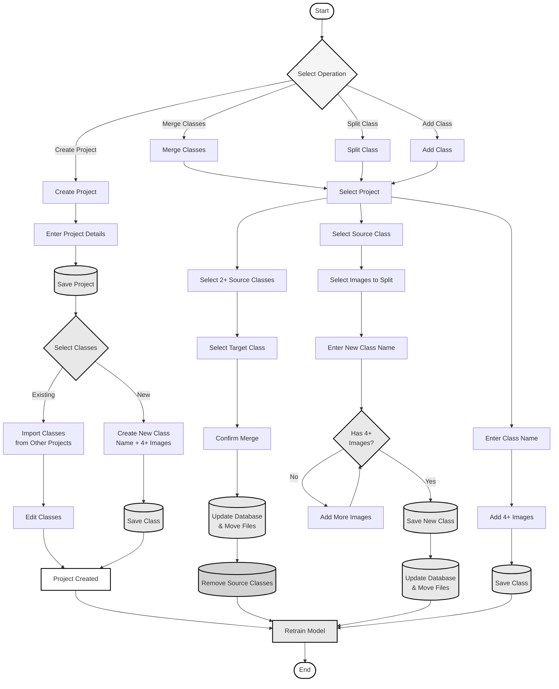

# Simple Project and Class Management Flowchart

A simplified flowchart for project creation, class merging, sub-classing, and model retraining.

---

## Simple Flowchart

---

## Operation Explanations

### 1. Create Project

**What it does**: Creates a new project with classes.

**Steps**:
1. Enter project details → Save project
2. Choose classes:
   - **Import existing** classes from other projects (can edit)
   - **Create new** class (name + minimum 4 images)
3. **Model is retrained** automatically

---

### 2. Merge Classes

**What it does**: Combines multiple classes into one.

**Steps**:
1. Select project
2. Select 2+ source classes
3. Select target class
4. Confirm → System updates database & moves files
5. Source classes removed
6. **Model is retrained** automatically

---

### 3. Split Class

**What it does**: Splits images from one class into a new class with different name.

**Steps**:
1. Select project
2. Select source class
3. Select images to split
4. Enter new class name (different from source)
5. Ensure 4+ images selected (add more if needed)
6. Save new class → System updates database & moves files
7. **Model is retrained** automatically

**Example**: Split "chaetoceros" → Create "chaetoceros_didymus"

---

### 4. Add Class

**What it does**: Adds a new class to existing project.

**Steps**:
1. Select project
2. Enter class name
3. Add minimum 4 images
4. Save class
5. **Model is retrained** automatically

---

## Key Points

### Classes and Model Relationship

**Question**: Do classes need to be in the model to be visible in the web UI?

**Answer**: 
- **Classes can exist in the UI without being in the model**
- Classes not in the model will appear in the web UI but require **manual classification**
- The model will only auto-classify images to classes it was trained on
- **After model retraining**, new classes are incorporated and can be auto-classified

### Model Retraining

**When model is retrained**:
- After project creation with new classes
- After merging classes
- After sub-classing (splitting)
- After adding new classes

**What happens during retraining**:
- New model incorporates all current classes
- Model learns from all available training images
- New classes become available for auto-classification
- Previous model is kept for reference

### Image Requirements

- **Minimum 4 images required** for any new class
- This ensures sufficient training data for model retraining
- Images are automatically organized into proper folder structure

### Automatic File Organization

All operations automatically handle image file storage:
- Files organized by: `project/year/month/class_name/`
- No manual file management needed
- System maintains consistency between database and file system

---

## Quick Reference

| Operation | Minimum Images | Model Retraining | Auto-Classification |
|-----------|----------------|------------------|---------------------|
| **Create Project** | 4 per new class | Yes | After retraining |
| **Merge Classes** | N/A | Yes | After retraining |
| **Sub-Class** | 4 for new class | Yes | After retraining |
| **Add Class** | 4 required | Yes | After retraining |

---

## Workflow Summary

All operations follow this pattern:
- Perform operation → System handles files automatically → **Retrain Model**

**Key Rules**:
- New classes require minimum 4 images
- All file operations are automatic
- Model retraining happens automatically after any change

---

This simplified flowchart focuses on the core operations with automatic file management and model retraining.

