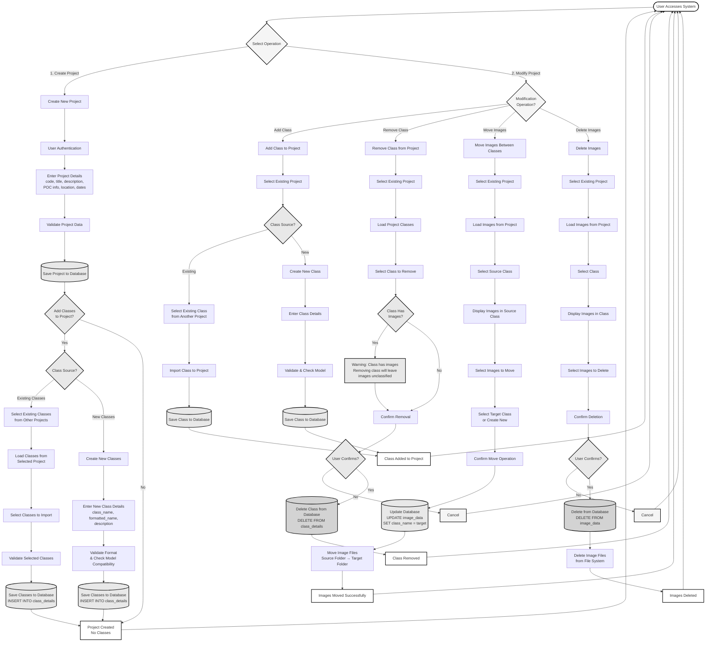

# Project Creation and Modification - Flowchart

A simplified flowchart for creating projects with classes and modifying existing projects by managing classes and images.

---

## Project Creation and Modification Flowchart

---

## Operation Explanations

### 1. Create Project with Classes

**What it does**: Creates a new research project and optionally adds classes to it.

**Key Steps**:
1. User must be authenticated
2. Enter project details (code, title, description, POC info, location, dates)
3. System validates all project data
4. Project is saved to database
5. **Optional**: Add classes to the project
   - **Option A - Existing Classes**: Import classes from another existing project
     - Select source project
     - Choose classes to import
     - Classes are copied to the new project
   - **Option B - New Classes**: Create brand new classes
     - Enter class details (name, formatted name, description)
     - System validates format and checks model compatibility
     - New classes are created and added to the project

**Use Case**: 
- Setting up a new research project with a predefined set of classes
- Starting a project similar to an existing one (import classes)
- Creating a project with custom classes specific to your research

---

### 2. Modify Existing Project - Add Class

**What it does**: Adds a new class to an existing project.

**Key Steps**:
1. Select the existing project
2. Choose class source:
   - **Existing Class**: Import from another project
   - **New Class**: Create a new class
3. If importing: Select class from another project and import it
4. If creating: Enter class details, validate, and save
5. Class is added to the project

**Use Case**:
- Adding a newly discovered species to an ongoing project
- Importing a class from another project that's relevant
- Expanding the class list as research progresses

---

### 3. Modify Existing Project - Remove Class

**What it does**: Removes a class definition from an existing project.

**Key Steps**:
1. Select the existing project
2. System loads all classes for that project
3. Select the class to remove
4. System checks if class has images:
   - **If class has images**: Shows warning that removing the class will leave images unclassified
   - **If class has no images**: Proceeds to confirmation
5. User confirms removal
6. Class is deleted from database
7. **Note**: Images remain in the file system but become unclassified

**Use Case**:
- Removing a class that's no longer relevant
- Cleaning up unused classes
- Correcting mistakes in class setup

**Important**: Removing a class does NOT delete images - they remain but need to be reclassified.

---

### 4. Modify Existing Project - Move Images

**What it does**: Moves images from one class to another within the same project.

**Key Steps**:
1. Select the existing project
2. System loads all images from the project
3. Select the source class (class containing images to move)
4. System displays all images in that class
5. User selects specific images to move
6. User selects target class (or creates a new one)
7. User confirms the move operation
8. System updates database: changes image classifications
9. System moves physical image files from source folder to target folder

**Use Case**:
- Correcting misclassified images
- Reorganizing images into more appropriate classes
- Moving images to a newly created class
- Consolidating images from multiple classes

**Important**: This operation updates both the database and file system to maintain consistency.

---

### 5. Modify Existing Project - Delete Images

**What it does**: Permanently removes images from the project.

**Key Steps**:
1. Select the existing project
2. System loads all images from the project
3. Select the class containing images to delete
4. System displays all images in that class
5. User selects specific images to delete
6. User confirms deletion
7. System deletes image records from database
8. System deletes image files from file system

**Use Case**:
- Removing poor quality images
- Deleting images that are not plankton
- Cleaning up duplicate or erroneous images
- Removing images that don't meet quality standards

**Important**: This operation is permanent and cannot be undone. Images are deleted from both database and file system.

---

## Quick Reference

| Operation | Purpose | Reversible? | Affects Images? |
|-----------|---------|-------------|------------------|
| **Create Project** | Start new research project | Yes (can update) | No |
| **Add Class** | Add class to existing project | Yes (can remove) | No |
| **Remove Class** | Remove class from project | No | No (but images need reclassification) |
| **Move Images** | Reclassify images to different class | Yes (can move back) | Yes (moves files) |
| **Delete Images** | Permanently remove images | No | Yes (deletes files) |

---

## Common Workflows

### Workflow 1: Setting Up a New Project
1. **Create Project** with project details
2. **Add Classes** - either import from existing project or create new ones
3. Start classifying images

### Workflow 2: Correcting Classifications
1. **Move Images** from incorrect class to correct class
2. If needed, **Add Class** for new category
3. If class becomes empty, **Remove Class**

### Workflow 3: Cleaning Up Project
1. **Delete Images** that are poor quality or not relevant
2. **Move Images** to consolidate similar classes
3. **Remove Class** for classes that are no longer needed

### Workflow 4: Expanding Project
1. **Add Class** for newly discovered species
2. **Move Images** from unclassified or other classes to new class
3. Continue classification work

---

## Important Notes

### Class Management
- Classes are project-specific - same class name can exist in different projects
- Removing a class does NOT delete images - only removes the class definition
- Images in a removed class become unclassified and need to be reclassified

### Image Management
- Moving images updates both database and file system
- Deleting images permanently removes them from both database and file system
- Always confirm before deleting images - this cannot be undone

### Data Integrity
- All operations maintain consistency between database and file system
- File organization: `project/year/month/class_name/image.png`
- Operations are logged for audit purposes

---

This flowchart provides a clear overview of project creation and modification operations for managing classes and images.

