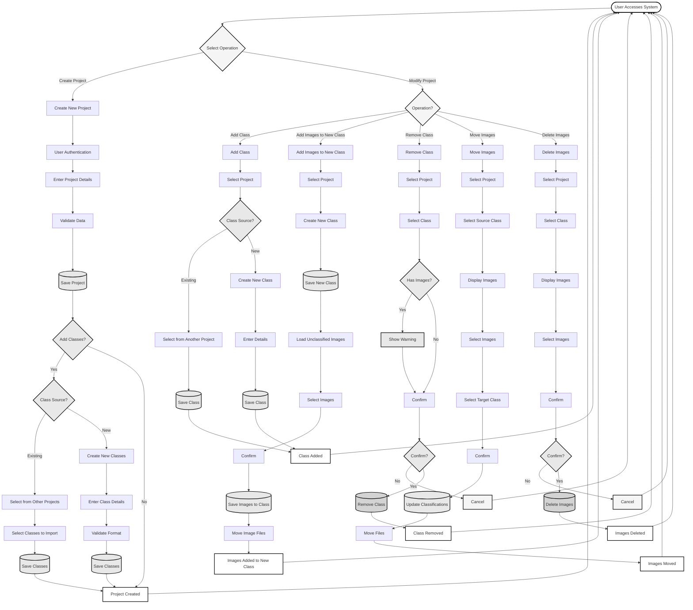

# Project Creation and Modification - Flowchart

A simplified flowchart for creating projects with classes and modifying existing projects by managing classes and images.

---

## Project Creation and Modification Flowchart

---

## Operation Explanations

### 1. Create Project with Classes

**What it does**: Creates a new research project and optionally adds classes to it.

**Key Steps**:
1. User authentication required
2. Enter project details
3. System validates data
4. Project is saved
5. **Optional**: Add classes to the project
   - **Existing Classes**: Import from another project
   - **New Classes**: Create new classes with details

**Use Case**: Setting up a new research project with classes.

---

### 2. Modify Existing Project - Add Class

**What it does**: Adds a new class to an existing project.

**Key Steps**:
1. Select the project
2. Choose to import existing class or create new class
3. If importing: Select class from another project
4. If creating: Enter class details
5. Class is saved to project

**Use Case**: Adding new species or categories to an ongoing project.

---

### 3. Modify Existing Project - Add Images to New Class

**What it does**: Creates a new class and adds selected images to it.

**Key Steps**:
1. Select the project
2. Create a new class with details
3. New class is saved
4. System loads unclassified images
5. User selects images to add to the new class
6. User confirms
7. Images are saved to the new class
8. Image files are moved to the new class folder

**Use Case**: 
- Creating a new class for images that don't fit existing categories
- Organizing unclassified images into a new category
- Adding a newly discovered species with existing images

---

### 4. Modify Existing Project - Remove Class

**What it does**: Removes a class definition from an existing project.

**Key Steps**:
1. Select the project
2. Select the class to remove
3. System checks if class has images
4. If images exist, warning is shown
5. User confirms removal
6. Class is removed
7. **Note**: Images remain but become unclassified

**Use Case**: Removing classes that are no longer relevant or needed.

**Important**: Removing a class does NOT delete images - they remain but need to be reclassified.

---

### 5. Modify Existing Project - Move Images

**What it does**: Moves images from one class to another within the same project.

**Key Steps**:
1. Select the project
2. Select source class
3. Display images in source class
4. Select images to move
5. Select target class
6. Confirm move operation
7. Update image classifications
8. Move image files to target folder

**Use Case**: Correcting misclassified images or reorganizing images into different classes.

---

### 6. Modify Existing Project - Delete Images

**What it does**: Permanently removes images from the project.

**Key Steps**:
1. Select the project
2. Select the class
3. Display images in class
4. Select images to delete
5. Confirm deletion
6. Images are deleted

**Use Case**: Removing poor quality images or images that don't meet standards.

**Important**: This operation is permanent and cannot be undone.

---

## Quick Reference

| Operation | Purpose | Reversible? | Affects Images? |
|-----------|---------|-------------|------------------|
| **Create Project** | Start new research project | Yes (can update) | No |
| **Add Class** | Add class to existing project | Yes (can remove) | No |
| **Add Images to New Class** | Create class and add images | Yes (can remove) | Yes (moves files) |
| **Remove Class** | Remove class from project | No | No (but images need reclassification) |
| **Move Images** | Reclassify images to different class | Yes (can move back) | Yes (moves files) |
| **Delete Images** | Permanently remove images | No | Yes (deletes files) |

---

## Common Workflows

### Workflow 1: Setting Up a New Project
1. **Create Project** with project details
2. **Add Classes** - either import from existing project or create new ones
3. Start classifying images

### Workflow 2: Correcting Classifications
1. **Move Images** from incorrect class to correct class
2. If needed, **Add Class** for new category
3. If class becomes empty, **Remove Class**

### Workflow 3: Cleaning Up Project
1. **Delete Images** that are poor quality or not relevant
2. **Move Images** to consolidate similar classes
3. **Remove Class** for classes that are no longer needed

### Workflow 4: Expanding Project
1. **Add Class** for newly discovered species
2. **Move Images** from unclassified or other classes to new class
3. Continue classification work

---

## Important Notes

### Class Management
- Classes are project-specific - same class name can exist in different projects
- Removing a class does NOT delete images - only removes the class definition
- Images in a removed class become unclassified and need to be reclassified

### Image Management
- Moving images updates both database and file system
- Deleting images permanently removes them from both database and file system
- Always confirm before deleting images - this cannot be undone

### Data Integrity
- All operations maintain consistency between database and file system
- File organization: `project/year/month/class_name/image.png`
- Operations are logged for audit purposes

---

This flowchart provides a clear overview of project creation and modification operations for managing classes and images.

