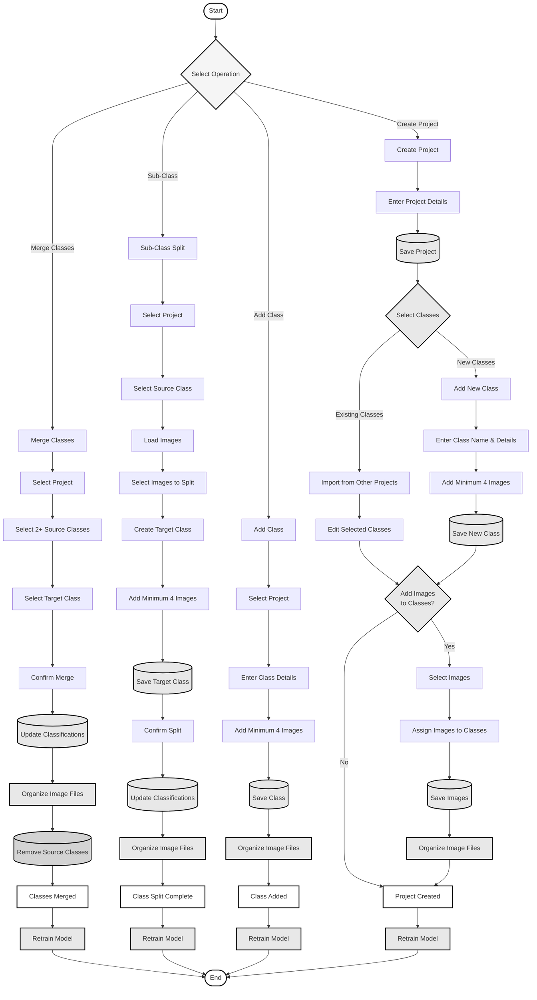

# Simple Project and Class Management Flowchart

A simplified flowchart for project creation, class merging, sub-classing, and model retraining.

---

## Simple Flowchart

---

## Operation Explanations

### 1. Create Project

**What it does**: Creates a new project with classes that can be edited.

**Key Steps**:
1. Enter project details
2. Save project
3. Select classes:
   - **Option A**: Import existing classes from other projects
   - **Option B**: Add new classes (requires minimum 4 images each)
4. Edit selected classes as needed
5. Optionally add images to classes
6. System organizes image files automatically
7. **Model is retrained** after project creation

**Important**: New classes require at least 4 images to be created.

---

### 2. Merge Classes

**What it does**: Combines multiple classes into one target class.

**Key Steps**:
1. Select project
2. Select 2 or more source classes
3. Select target class
4. Confirm merge
5. Update all image classifications
6. System organizes image files automatically
7. Remove source classes
8. **Model is retrained** after merge

**Use Case**: Consolidating similar classes or correcting taxonomy.

---

### 3. Sub-Class (Split)

**What it does**: Splits images from one class into a new sub-class.

**Key Steps**:
1. Select project
2. Select source class
3. Load images from source class
4. Select images to split out
5. Create target class (new sub-class)
6. Add minimum 4 images to new class
7. Save target class
8. Confirm split
9. Update classifications
10. System organizes image files automatically
11. **Model is retrained** after split

**Important**: New sub-class requires at least 4 images.

---

### 4. Add Class to Existing Project

**What it does**: Adds a new class to an existing project.

**Key Steps**:
1. Select project
2. Enter class details
3. Add minimum 4 images to the class
4. Save class
5. System organizes image files automatically
6. **Model is retrained** after adding class

**Important**: New classes require at least 4 images.

---

## Key Points

### Classes and Model Relationship

**Question**: Do classes need to be in the model to be visible in the web UI?

**Answer**: 
- **Classes can exist in the UI without being in the model**
- Classes not in the model will appear in the web UI but require **manual classification**
- The model will only auto-classify images to classes it was trained on
- **After model retraining**, new classes are incorporated and can be auto-classified

### Model Retraining

**When model is retrained**:
- After project creation with new classes
- After merging classes
- After sub-classing (splitting)
- After adding new classes

**What happens during retraining**:
- New model incorporates all current classes
- Model learns from all available training images
- New classes become available for auto-classification
- Previous model is kept for reference

### Image Requirements

- **Minimum 4 images required** for any new class
- This ensures sufficient training data for model retraining
- Images are automatically organized into proper folder structure

### Automatic File Organization

All operations automatically handle image file storage:
- Files organized by: `project/year/month/class_name/`
- No manual file management needed
- System maintains consistency between database and file system

---

## Quick Reference

| Operation | Minimum Images | Model Retraining | Auto-Classification |
|-----------|----------------|------------------|---------------------|
| **Create Project** | 4 per new class | Yes | After retraining |
| **Merge Classes** | N/A | Yes | After retraining |
| **Sub-Class** | 4 for new class | Yes | After retraining |
| **Add Class** | 4 required | Yes | After retraining |

---

## Workflow Summary

1. **Create Project** → Select/Edit Classes → Add Images → **Retrain Model**
2. **Merge Classes** → Update Classifications → **Retrain Model**
3. **Sub-Class** → Create New Class (4+ images) → **Retrain Model**
4. **Add Class** → Add 4+ Images → **Retrain Model**

**All operations trigger model retraining to incorporate changes.**

---

This simplified flowchart focuses on the core operations with automatic file management and model retraining.

