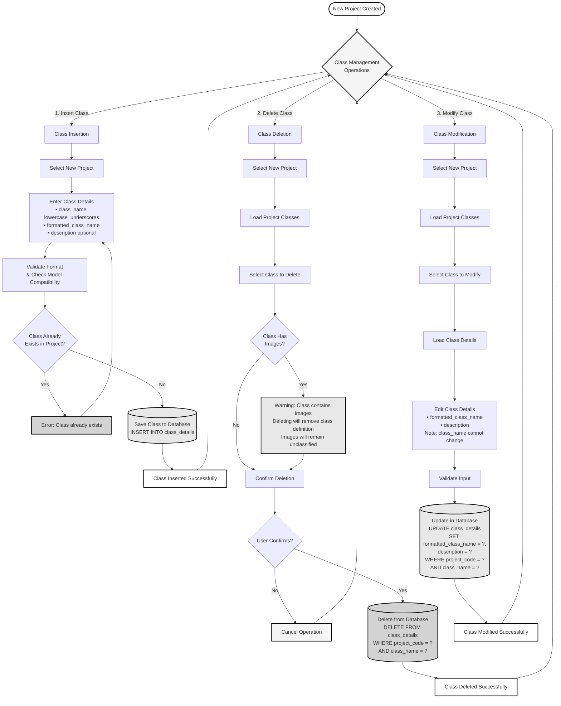

# New Project Class Operations - Simplified Flowchart

A simplified flowchart for managing classes in a new project: Insertion, Deletion, and Modification.

---

## Class Operations Flowchart for New Project

---

## Operation Explanations

### 1. Class Insertion (Adding Classes to New Project)

**What it does**: Adds a new plankton class to your new project.

**Key Steps**:
1. Select your new project
2. Enter class details:
   - **Class name**: Must be lowercase with underscores (e.g., `chaetoceros_didymus`)
   - **Formatted name**: Display name with proper formatting (e.g., `Chaetoceros didymus`)
   - **Description**: Optional description of the class
3. System validates:
   - Class name format (lowercase_underscores only)
   - Checks if class already exists in this project
   - Checks if class is in the model's training set (for auto-classification capability)
4. If class is not in model, system shows warning that it will require manual classification
5. Class is saved to database

**Use Case**: 
- Adding plankton species you expect to find in your project
- Setting up the initial class list for a new research project
- Adding classes discovered during initial data review

**Important Notes**:
- Class names must be unique per project
- Classes in the model can be auto-classified
- Classes not in the model require manual classification

---

### 2. Class Deletion (Removing Classes from New Project)

**What it does**: Removes a class definition from your new project.

**Key Steps**:
1. Select your new project
2. System loads all classes for that project
3. Select the class you want to delete
4. System checks if the class has any images:
   - **If class has images**: Shows warning that deleting will remove the class definition, but images will remain (they'll need to be reclassified)
   - **If class has no images**: Proceeds directly to confirmation
5. User confirms deletion
6. Class is removed from database

**Use Case**:
- Removing a class that was added by mistake
- Removing a class that's not relevant to your project
- Cleaning up unused classes before starting classification

**Important Notes**:
- Deleting a class does NOT delete images - it only removes the class definition
- Images that were classified to this class will need to be reclassified
- This operation cannot be easily undone

---

### 3. Class Modification (Updating Class Details)

**What it does**: Updates the display name or description of an existing class.

**Key Steps**:
1. Select your new project
2. System loads all classes for that project
3. Select the class you want to modify
4. System loads current class details
5. Edit the formatted name and/or description
6. **Note**: The class name itself (the identifier) cannot be changed
7. System validates the input
8. Changes are saved to database

**Use Case**:
- Fixing typos in display names
- Improving class descriptions
- Updating class documentation
- Standardizing naming conventions

**Important Notes**:
- Only `formatted_class_name` and `description` can be modified
- The `class_name` (identifier) cannot be changed - if you need to change it, you must delete and recreate the class
- Changes affect how the class is displayed but don't affect existing classifications

---

## Quick Reference

| Operation | When to Use | Reversible? | Affects Images? |
|-----------|-------------|-------------|-----------------|
| **Insert Class** | Adding new classes to project | Yes (can delete) | No |
| **Delete Class** | Removing unwanted classes | No | No (but images need reclassification) |
| **Modify Class** | Fixing names/descriptions | Yes | No |

---

## Common Scenarios for New Projects

### Scenario 1: Setting Up Initial Class List
1. **Insert** classes you expect to find
2. **Modify** any display names that need formatting
3. Review and **Delete** any classes that aren't relevant

### Scenario 2: Correcting Mistakes
1. **Modify** class if only display name/description is wrong
2. **Delete** and re-insert if class name itself is wrong

### Scenario 3: Refining Class List
1. Start with a broad set of classes
2. **Modify** descriptions as you learn more
3. **Delete** classes that aren't found in your data
4. **Insert** new classes as you discover new species

---

## Validation Rules

### Class Name Format
- Must be lowercase
- Use underscores for spaces (e.g., `chaetoceros_didymus`)
- No special characters except underscores
- Examples: ✅ `chaetoceros_didymus`, ❌ `ChaetocerosDidymus`, ❌ `chaetoceros-didymus`

### Uniqueness
- Class name must be unique within the project
- Same class name can exist in different projects
- System prevents duplicate class names in the same project

### Model Compatibility
- System checks if class exists in trained model
- Model classes: Can be auto-classified by the AI
- Non-model classes: Require manual classification
- Warning shown when adding non-model classes

---

This simplified flowchart focuses on the three core class management operations for new projects.

