# Project Creation and Modification - Flowchart

A simplified flowchart for creating projects with classes and modifying existing projects by managing classes and images.

---

## Project Creation and Modification Flowchart

```mermaid
flowchart TB
    Start([User Accesses System]) --> MainMenu{Select Operation}
    
    %% PROJECT CREATION
    MainMenu -->|Create Project| CreateProject[Create New Project]
    CreateProject --> Auth1[User Authentication]
    Auth1 --> Form1[Enter Project Details]
    Form1 --> Validate1[Validate Data]
    Validate1 --> SaveProject[(Save Project)]
    SaveProject --> ClassOption{Add Classes?}
    
    ClassOption -->|Yes| ClassSource{Class Source?}
    ClassOption -->|No| ProjectCreated[Project Created]
    
    ClassSource -->|Existing| SelectExisting[Select from Other Projects]
    ClassSource -->|New| CreateNew[Create New Classes]
    
    SelectExisting --> SelectClasses1[Select Classes to Import]
    SelectClasses1 --> SaveClasses1[(Save Classes)]
    
    CreateNew --> FormNew[Enter Class Details]
    FormNew --> ValidateNew[Validate Format]
    ValidateNew --> SaveClasses2[(Save Classes)]
    
    SaveClasses1 --> AddImagesOption1{Add Images<br/>to Classes?}
    SaveClasses2 --> AddImagesOption1
    
    AddImagesOption1 -->|Yes| LoadUnclassified1[Load Unclassified Images]
    AddImagesOption1 -->|No| ProjectCreated[Project Created]
    
    LoadUnclassified1 --> SelectImages1[Select Images]
    SelectImages1 --> AssignImages1[Assign Images to Classes]
    AssignImages1 --> SaveImages1[(Save Images)]
    SaveImages1 --> OrganizeFiles1[Organize Image Files]
    OrganizeFiles1 --> ProjectCreated
    
    %% MODIFY EXISTING PROJECT - ADD CLASS
    MainMenu -->|Modify Project| ModifyMenu{Operation?}
    ModifyMenu -->|Add Class| AddClass[Add Class]
    AddClass --> SelectProject2[Select Project]
    SelectProject2 --> ClassSource2{Class Source?}
    
    ClassSource2 -->|Existing| SelectExisting2[Select from Another Project]
    ClassSource2 -->|New| CreateNew2[Create New Class]
    
    SelectExisting2 --> SaveClass1[(Save Class)]
    CreateNew2 --> FormNew2[Enter Details]
    FormNew2 --> SaveClass2[(Save Class)]
    
    SaveClass1 --> AddImagesOption2{Add Images<br/>to Class?}
    SaveClass2 --> AddImagesOption2
    
    AddImagesOption2 -->|Yes| LoadUnclassified2[Load Unclassified Images]
    AddImagesOption2 -->|No| ClassAdded[Class Added]
    
    LoadUnclassified2 --> SelectImages2[Select Images]
    SelectImages2 --> AssignImages2[Assign Images to Class]
    AssignImages2 --> SaveImages2[(Save Images)]
    SaveImages2 --> OrganizeFiles2[Organize Image Files]
    OrganizeFiles2 --> ClassAdded
    
    %% MODIFY EXISTING PROJECT - MODIFY CLASS
    ModifyMenu -->|Modify Class| ModifyClass[Modify Class]
    ModifyClass --> SelectProject7[Select Project]
    SelectProject7 --> SelectClass7[Select Class]
    SelectClass7 --> LoadClassDetails7[Load Class Details]
    LoadClassDetails7 --> EditDetails7[Edit Class Details]
    EditDetails7 --> SaveChanges7[(Save Changes)]
    SaveChanges7 --> ClassModified[Class Modified]
    
    %% MODIFY EXISTING PROJECT - SPLIT CLASS
    ModifyMenu -->|Split Class| SplitClass[Split Class]
    SplitClass --> SelectProject8[Select Project]
    SelectProject8 --> SelectSourceClass8[Select Source Class]
    SelectSourceClass8 --> LoadImages8[Load Images from Class]
    LoadImages8 --> SelectImages8[Select Images to Split]
    SelectImages8 --> CreateTargetClass8[Create/Select Target Class]
    CreateTargetClass8 --> SaveTargetClass8[(Save Target Class)]
    SaveTargetClass8 --> ConfirmSplit8[Confirm Split]
    ConfirmSplit8 --> UpdateSplit8[(Update Classifications)]
    UpdateSplit8 --> OrganizeFilesSplit8[Organize Image Files]
    OrganizeFilesSplit8 --> ClassSplit[Class Split Complete]
    
    %% MODIFY EXISTING PROJECT - COMBINE CLASSES
    ModifyMenu -->|Combine Classes| CombineClass[Combine Classes]
    CombineClass --> SelectProject9[Select Project]
    SelectProject9 --> SelectSourceClasses9[Select 2+ Source Classes]
    SelectSourceClasses9 --> SelectTargetClass9[Select Target Class]
    SelectTargetClass9 --> PreviewCombine9[Preview Combine Operation]
    PreviewCombine9 --> ConfirmCombine9[Confirm Combine]
    ConfirmCombine9 --> UpdateCombine9[(Update Classifications)]
    UpdateCombine9 --> OrganizeFilesCombine9[Organize Image Files]
    OrganizeFilesCombine9 --> RemoveSourceClasses9[(Remove Source Classes)]
    RemoveSourceClasses9 --> ClassesCombined[Classes Combined]
    
    %% MODIFY EXISTING PROJECT - REMOVE CLASS
    ModifyMenu -->|Remove Class| RemoveClass[Remove Class]
    RemoveClass --> SelectProject3[Select Project]
    SelectProject3 --> SelectClass3[Select Class]
    SelectClass3 --> CheckImages3{Has Images?}
    CheckImages3 -->|Yes| Warning3[Show Warning]
    CheckImages3 -->|No| Confirm3[Confirm]
    Warning3 --> Confirm3
    Confirm3 --> UserConfirm3{Confirm?}
    UserConfirm3 -->|No| Cancel3[Cancel]
    UserConfirm3 -->|Yes| DeleteClass3[(Remove Class)]
    DeleteClass3 --> ClassRemoved[Class Removed]
    
    %% MODIFY EXISTING PROJECT - MOVE IMAGES
    ModifyMenu -->|Move Images| MoveImages[Move Images]
    MoveImages --> SelectProject4[Select Project]
    SelectProject4 --> SelectSourceClass4[Select Source Class]
    SelectSourceClass4 --> DisplayImages4[Display Images]
    DisplayImages4 --> SelectImages4[Select Images]
    SelectImages4 --> SelectTargetClass4[Select Target Class]
    SelectTargetClass4 --> ConfirmMove4[Confirm]
    ConfirmMove4 --> UpdateImages4[(Update Classifications)]
    UpdateImages4 --> OrganizeFiles4[Organize Image Files]
    OrganizeFiles4 --> ImagesMoved[Images Moved]
    
    %% MODIFY EXISTING PROJECT - DELETE IMAGES
    ModifyMenu -->|Delete Images| DeleteImages[Delete Images]
    DeleteImages --> SelectProject5[Select Project]
    SelectProject5 --> SelectClass5[Select Class]
    SelectClass5 --> DisplayImages5[Display Images]
    DisplayImages5 --> SelectImages5[Select Images]
    SelectImages5 --> ConfirmDelete5[Confirm]
    ConfirmDelete5 --> UserConfirm5{Confirm?}
    UserConfirm5 -->|No| Cancel5[Cancel]
    UserConfirm5 -->|Yes| DeleteImages5[(Delete Images)]
    DeleteImages5 --> CleanupFiles5[Cleanup Image Files]
    CleanupFiles5 --> ImagesDeleted[Images Deleted]
    
    ProjectCreated --> Start
    ClassAdded --> Start
    ClassModified --> Start
    ClassSplit --> Start
    ClassesCombined --> Start
    ClassRemoved --> Start
    ImagesMoved --> Start
    ImagesDeleted --> Start
    Cancel3 --> Start
    Cancel5 --> Start
    
    %% Styling - Simple Black and White
    style Start fill:#ffffff,stroke:#000000,stroke-width:2px
    style MainMenu fill:#f5f5f5,stroke:#000000,stroke-width:2px
    style ModifyMenu fill:#f5f5f5,stroke:#000000,stroke-width:2px
    style ClassOption fill:#e8e8e8,stroke:#000000,stroke-width:2px
    style ClassSource fill:#e8e8e8,stroke:#000000,stroke-width:2px
    style ClassSource2 fill:#e8e8e8,stroke:#000000,stroke-width:2px
    style CheckImages3 fill:#e8e8e8,stroke:#000000,stroke-width:2px
    style UserConfirm3 fill:#e8e8e8,stroke:#000000,stroke-width:2px
    style UserConfirm5 fill:#e8e8e8,stroke:#000000,stroke-width:2px
    
    style ClassOption fill:#e8e8e8,stroke:#000000,stroke-width:2px
    style AddImagesOption1 fill:#e8e8e8,stroke:#000000,stroke-width:2px
    style AddImagesOption2 fill:#e8e8e8,stroke:#000000,stroke-width:2px
    
    style ProjectCreated fill:#ffffff,stroke:#000000,stroke-width:2px
    style ClassAdded fill:#ffffff,stroke:#000000,stroke-width:2px
    style ClassModified fill:#ffffff,stroke:#000000,stroke-width:2px
    style ClassSplit fill:#ffffff,stroke:#000000,stroke-width:2px
    style ClassesCombined fill:#ffffff,stroke:#000000,stroke-width:2px
    style ClassRemoved fill:#ffffff,stroke:#000000,stroke-width:2px
    style ImagesMoved fill:#ffffff,stroke:#000000,stroke-width:2px
    style ImagesDeleted fill:#ffffff,stroke:#000000,stroke-width:2px
    
    style SaveProject fill:#e8e8e8,stroke:#000000,stroke-width:2px
    style SaveClasses1 fill:#e8e8e8,stroke:#000000,stroke-width:2px
    style SaveClasses2 fill:#e8e8e8,stroke:#000000,stroke-width:2px
    style SaveClass1 fill:#e8e8e8,stroke:#000000,stroke-width:2px
    style SaveClass2 fill:#e8e8e8,stroke:#000000,stroke-width:2px
    style SaveImages1 fill:#e8e8e8,stroke:#000000,stroke-width:2px
    style SaveImages2 fill:#e8e8e8,stroke:#000000,stroke-width:2px
    style SaveChanges7 fill:#e8e8e8,stroke:#000000,stroke-width:2px
    style SaveTargetClass8 fill:#e8e8e8,stroke:#000000,stroke-width:2px
    style UpdateSplit8 fill:#e8e8e8,stroke:#000000,stroke-width:2px
    style UpdateCombine9 fill:#e8e8e8,stroke:#000000,stroke-width:2px
    style DeleteClass3 fill:#d3d3d3,stroke:#000000,stroke-width:2px
    style UpdateImages4 fill:#e8e8e8,stroke:#000000,stroke-width:2px
    style DeleteImages5 fill:#d3d3d3,stroke:#000000,stroke-width:2px
    style RemoveSourceClasses9 fill:#d3d3d3,stroke:#000000,stroke-width:2px
    
    style OrganizeFiles1 fill:#e8e8e8,stroke:#000000,stroke-width:2px
    style OrganizeFiles2 fill:#e8e8e8,stroke:#000000,stroke-width:2px
    style OrganizeFilesSplit8 fill:#e8e8e8,stroke:#000000,stroke-width:2px
    style OrganizeFilesCombine9 fill:#e8e8e8,stroke:#000000,stroke-width:2px
    style OrganizeFiles4 fill:#e8e8e8,stroke:#000000,stroke-width:2px
    style CleanupFiles5 fill:#d3d3d3,stroke:#000000,stroke-width:2px
    
    style Warning3 fill:#e8e8e8,stroke:#000000,stroke-width:2px
    style Cancel3 fill:#f5f5f5,stroke:#000000,stroke-width:2px
    style Cancel5 fill:#f5f5f5,stroke:#000000,stroke-width:2px
```

---

## Operation Explanations

### 1. Create Project with Classes

**What it does**: Creates a new research project and optionally adds classes to it.

**Key Steps**:
1. User authentication required
2. Enter project details
3. System validates data
4. Project is saved
5. **Optional**: Add classes to the project
   - **Existing Classes**: Import from another project
   - **New Classes**: Create new classes with details
6. **After adding classes**: Option to add images immediately
   - System loads unclassified images
   - User selects images and assigns them to classes
   - Images are saved and files are organized automatically

**Use Case**: Setting up a new research project with classes and optionally adding images.

---

### 2. Modify Existing Project - Add Class

**What it does**: Adds a new class to an existing project with option to add images immediately.

**Key Steps**:
1. Select the project
2. Choose to import existing class or create new class
3. If importing: Select class from another project
4. If creating: Enter class details
5. Class is saved to project
6. **Option to add images immediately**:
   - System loads unclassified images
   - User selects images to assign to the new class
   - Images are saved and files are organized automatically

**Use Case**: Adding new species or categories to an ongoing project, optionally with images.

---

### 3. Modify Existing Project - Modify Class

**What it does**: Updates class details such as display name and description.

**Key Steps**:
1. Select the project
2. Select the class to modify
3. Load current class details
4. Edit class details (formatted name, description)
5. Save changes

**Use Case**: Fixing typos, updating descriptions, or improving class documentation.

**Note**: Class name itself cannot be changed - only display name and description.

---

### 4. Modify Existing Project - Split Class

**What it does**: Splits a class by moving selected images to a new or existing target class.

**Key Steps**:
1. Select the project
2. Select the source class to split from
3. Load images from the source class
4. Select images to split out
5. Create a new target class or select existing one
6. Save target class if new
7. Confirm split operation
8. Update image classifications
9. **System automatically organizes image files** to correct folders

**Use Case**: 
- Separating misclassified images from a class
- Creating a new class by splitting out a subset of images
- Refining classifications by separating images

**Important**: Image files are automatically organized - no manual file management needed.

---

### 5. Modify Existing Project - Combine Classes

**What it does**: Combines multiple classes into one by moving all images to a target class.

**Key Steps**:
1. Select the project
2. Select 2 or more source classes to combine
3. Select the target class (where all images will go)
4. Preview the combine operation
5. Confirm combine operation
6. Update all image classifications
7. **System automatically organizes image files** to target class folder
8. Source classes are removed

**Use Case**:
- Consolidating similar classes
- Merging classes that represent the same species
- Simplifying taxonomy by combining related classes

**Important**: Image files are automatically organized and source classes are removed.

---

### 6. Modify Existing Project - Remove Class

**What it does**: Removes a class definition from an existing project.

**Key Steps**:
1. Select the project
2. Select the class to remove
3. System checks if class has images
4. If images exist, warning is shown
5. User confirms removal
6. Class is removed
7. **Note**: Images remain but become unclassified

**Use Case**: Removing classes that are no longer relevant or needed.

**Important**: Removing a class does NOT delete images - they remain but need to be reclassified.

---

### 7. Modify Existing Project - Move Images

**What it does**: Moves images from one class to another within the same project.

**Key Steps**:
1. Select the project
2. Select source class
3. Display images in source class
4. Select images to move
5. Select target class
6. Confirm move operation
7. Update image classifications
8. **System automatically organizes image files** to target folder

**Use Case**: Correcting misclassified images or reorganizing images into different classes.

**Important**: Image files are automatically organized - no manual file management needed.

---

### 8. Modify Existing Project - Delete Images

**What it does**: Permanently removes images from the project.

**Key Steps**:
1. Select the project
2. Select the class
3. Display images in class
4. Select images to delete
5. Confirm deletion
6. Images are deleted from database
7. **System automatically cleans up image files** from file system

**Use Case**: Removing poor quality images or images that don't meet standards.

**Important**: This operation is permanent and cannot be undone. Files are automatically cleaned up.

---

## Quick Reference

| Operation | Purpose | Reversible? | Image Storage |
|-----------|---------|-------------|---------------|
| **Create Project** | Start new research project | Yes (can update) | Automatic |
| **Add Class** | Add class to existing project | Yes (can remove) | Automatic |
| **Modify Class** | Update class details | Yes | Automatic |
| **Split Class** | Split images from one class to another | Partial | Automatic |
| **Combine Classes** | Merge multiple classes into one | No | Automatic |
| **Remove Class** | Remove class from project | No | Images remain unclassified |
| **Move Images** | Reclassify images to different class | Yes (can move back) | Automatic |
| **Delete Images** | Permanently remove images | No | Automatic cleanup |

---

## Common Workflows

### Workflow 1: Setting Up a New Project
1. **Create Project** with project details
2. **Add Classes** - either import from existing project or create new ones
3. Start classifying images

### Workflow 2: Correcting Classifications
1. **Move Images** from incorrect class to correct class
2. If needed, **Add Class** for new category
3. If class becomes empty, **Remove Class**

### Workflow 3: Cleaning Up Project
1. **Delete Images** that are poor quality or not relevant
2. **Move Images** to consolidate similar classes
3. **Remove Class** for classes that are no longer needed

### Workflow 4: Expanding Project
1. **Add Class** for newly discovered species
2. **Move Images** from unclassified or other classes to new class
3. Continue classification work

---

## Important Notes

### Class Management
- Classes are project-specific - same class name can exist in different projects
- Removing a class does NOT delete images - only removes the class definition
- Images in a removed class become unclassified and need to be reclassified

### Image Management
- Moving images updates both database and file system
- Deleting images permanently removes them from both database and file system
- Always confirm before deleting images - this cannot be undone

### Data Integrity
- All operations maintain consistency between database and file system
- File organization: `project/year/month/class_name/image.png`
- Operations are logged for audit purposes

---

This flowchart provides a clear overview of project creation and modification operations for managing classes and images.

